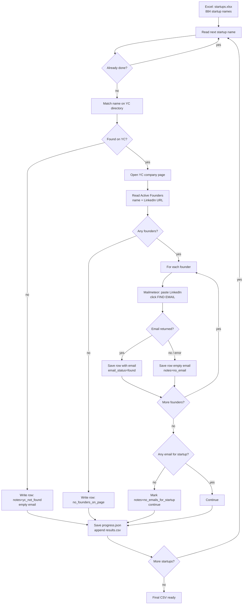

# Automation flow (start to finish)

This is the same work you did by hand — automated end to end. **Nothing sends email.**

---

## Visual flow



---

## Step by step (what the script does)

| Step | Your manual action | Automation |
|------|-------------------|------------|
| 1 | Open Excel, copy startup name | Reads `C:\Users\hardi\Downloads\startups.xlsx` column `Startup` |
| 2 | Search on ycombinator.com/companies | Fuzzy match against YC company list (~5,900 companies) |
| 3 | Open company page | Opens `ycombinator.com/companies/{slug}` |
| 4 | Copy founder LinkedIn from Active Founders | Parses founder name + `linkedin.com/in/...` |
| 5 | Paste LinkedIn in Mailmeteor, FIND EMAIL | Chrome + Mailmeteor tool (same website) |
| 6 | Copy email into your sheet | Writes one CSV row per founder |
| 7 | Next startup | Repeats; **skips** if no email (does not stop) |

---

## When there is no email

| Situation | What happens |
|-----------|----------------|
| Mailmeteor finds no email for one founder | Row saved with empty `email`, `email_status=not_found`, continues |
| Mailmeteor error (e.g. Cloudflare) | Skips **remaining founders** for that startup, goes to **next startup** |
| No email for **any** founder at that startup | Notes set to `no_emails_for_startup`, moves to next startup |
| Startup not on YC | One row, `notes=yc_not_found`, moves on |
| No founders on page | One row, `notes=no_founders_on_page`, moves on |

The run **never waits forever** on a missing email.

---

## Files

| File | Role |
|------|------|
| `startups.xlsx` | Input (your list) |
| `output/results.csv` | **Final output** — all startups in one file |
| `data/progress.json` | Resume checkpoint if you stop the run |
| `data/chrome-mailmeteor-profile/` | Chrome cookies after warmup (Cloudflare) |

---

## Commands (order)

```powershell
cd C:\Users\hardi\yc-founder-enrichment

# 1) Once: pass Cloudflare in Chrome
.\run-warmup.ps1

# 2) Test 5 startups
.\run-pilot.ps1

# 3) All 884 startups (hours; safe to stop and resume)
.\run-full.ps1
```

---

## Example CSV rows

**Success:**

| startup_name | founder_name | linkedin_url | email | email_status |
|--------------|--------------|--------------|-------|--------------|
| Caseflood.ai | Ethan Hilton | https://linkedin.com/in/ethan-hilton/ | ethan@... | found |

**No email (startup skipped forward):**

| startup_name | founder_name | linkedin_url | email | email_status | notes |
|--------------|--------------|--------------|-------|--------------|-------|
| SomeCo | Jane Doe | https://linkedin.com/in/jane/ | | not_found | no_emails_for_startup |

---

## Time

- ~30–60 seconds per founder (Mailmeteor + delay)
- ~884 startups × ~2 founders ≈ **many hours** for full run  
- Use `.\run-full.ps1` and leave PC on; rerun same command if interrupted.
